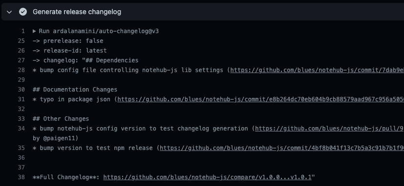
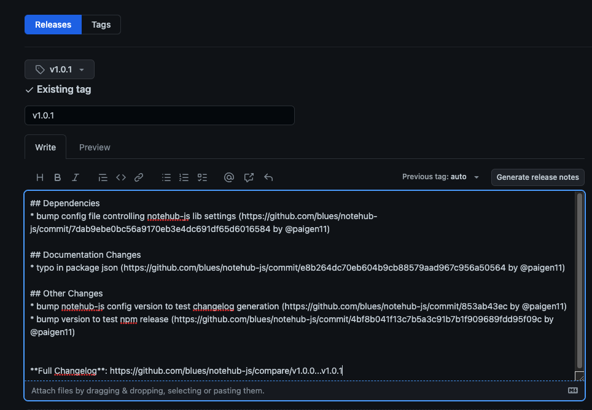

# Blues Notehub JS

The notehub-js library is a JavaScript implementation for communicating with the [Blues Notehub API](https://dev.blues.io/reference/notehub-api/api-introduction/)
generated by the [OpenAPI Generator](https://openapi-generator.tech) tool.

This library is auto-generated via the `openapi.yaml` file from the Blues Wireless Notehub project and published
to [npm](https://www.npmjs.com/package/@blues-inc/notehub-js) for ease of use in JavaScript-based projects that need to interact with [Notehub.io][notehub].

A small change.

## Table of Contents

- [Blues Notehub JS](#blues-notehub-js)
  - [Table of Contents](#table-of-contents)
  - [Installation](#installation)
  - [Sample Code](#sample-code)
    - [Real World Use Cases of Notehub JS Library](#real-world-use-cases-of-notehub-js-library)
  - [Further Library Documentation \& Code Examples](#further-library-documentation--code-examples)
  - [Project Structure](#project-structure)
    - [High Level Project Overview](#high-level-project-overview)
    - [Root Folder](#root-folder)
    - [`src/` Folder](#src-folder)
  - [Repo Usage](#repo-usage)
    - [Initial Project Setup \& Dependencies](#initial-project-setup--dependencies)
    - [Modifying the Project](#modifying-the-project)
    - [Updating the Auto-Generated notehub-js Library](#updating-the-auto-generated-notehub-js-library)
    - [Testing the Library Locally](#testing-the-library-locally)
  - [Deploying notehub-js to npm](#deploying-notehub-js-to-npm)
    - [Steps to Publish an Updated npm Version of Repo](#steps-to-publish-an-updated-npm-version-of-repo)
  - [Contributing](#contributing)
    - [Resources](#resources)
  - [To learn more about Blues Wireless, the Notecard and Notehub, see:](#to-learn-more-about-blues-wireless-the-notecard-and-notehub-see)
  - [License](#license)

## Installation

Using npm:

```shell
$ npm install @blues-inc/notehub-js
```

Using yarn:

```shell
$ yarn add @blues-inc/notehub-js
```

Once the package is installed, you can import the library using `import` or `require`:

**import**

```javascript
import * as NotehubJs from "@blues-inc/notehub-js";

const defaultClient = NotehubJs.ApiClient.instance;
```

> **NOTE:** Using `import` to access the library in a TypeScript project currently will cause an error because there is not yet a `@types` file for it. To make the error disappear, declare the module in a file with a `.d.ts` extension. `declare module '@blues-inc/notehub-js';`

**require**

```javascript
const NotehubJs = require("@blues-inc/notehub-js");

const defaultClient = NotehubJs.ApiClient.instance;
```

## Sample Code

Here is an example of how to fetch all devices associated with a particular [Notehub project](https://dev.blues.io/reference/glossary/#project).

The `api-key` variable declared below is an `X-SESSION-TOKEN` authentication token required for all Notehub API requests.

It can be obtained in two ways:

**Manually cURL the token from the command line**

Using the command line, a user can request a new token from the
[Notehub API `/auth/login` endpoint](https://dev.blues.io/reference/notehub-api/api-introduction/#authentication-with-session-tokens-deprecated)
using a Notehub username and password in the body of the request.

**Use NotehubJs.AuthorizationApi login**

Using this library, a user can programmatically call the Notehub API's `/auth/login` endpoint
via the [NotehubJs.AuthorizationApi's `login()`](/src/docs/AuthorizationApi.md#login) method while supplying a Notehub username and
password in the `loginRequest` object.

Then supply the newly generated authentication token to whatever method the library needs, by setting it equal to: `api_key.apiKey = "YOUR API KEY";` in the code.

> **NOTE**: Be aware that all Notehub API calls made using the Notehub JS library utilize your account's [Consumption Credits](https://dev.blues.io/reference/glossary#consumption-credit) (CCs). For > more information, please consult our [pricing page](https://blues.io/pricing/).

```javascript
import * as NotehubJs from "@blues-inc/notehub-js";

let defaultClient = NotehubJs.ApiClient.instance;

// Configure API key authorization: api_key
let api_key = defaultClient.authentications["api_key"];
api_key.apiKey = "YOUR API KEY";

let apiInstance = new NotehubJs.ProjectApi();
let projectUID = "app:2606f411-dea6-44a0-9743-1130f57d77d8;"; // String |
let opts = {
  pageSize: 50, // Number |
  pageNum: 1, // Number |
};

// Want to use async/await? Add the 'async' keyword to your outer function/method.
apiInstance.getProjectDevices(projectUID, opts).then(
  (data) => {
    console.log(
      "API called successfully. Returned data: " + JSON.stringify(data)
    );
  },
  (error) => {
    console.error(error);
  }
);
```

### Real World Use Cases of Notehub JS Library

As this library gains adoptions, we'll continue to provide new links to repos where this library being used in real world projects.

[**Indoor Floor Level Tracker Project**](https://github.com/blues/app-accelerators/tree/main/01-indoor-floor-level-tracker/web-app)

If you'd like to see examples of this library being used in real-world applications, check out [this indoor floor-level tracker project](https://github.com/blues/app-accelerators/tree/main/01-indoor-floor-level-tracker/web-app) in the [Blues App Accelerator repo](https://github.com/blues/app-accelerators/blob/main/) on GitHub.

The files that deserve special attention are:

- [`ServiceLocatorServer.ts`](https://github.com/blues/app-accelerators/blob/main/01-indoor-floor-level-tracker/web-app/src/services/ServiceLocatorServer.ts) - this file makes the variety of services composing the backend logic of the application discoverable to each other. For DRY-er code, the Notehub JS library's instances were created and passed to the various services that would require them to fetch and update data via the Notehub API. An instance of the Notehub JS client is created via `const notehubJsClient = NotehubJs.ApiClient.instance`, and passed to the `getDataProvider()` and `getAttributeStore()` services that will need to interact with the Notehub API to perform their duties.
- [`NotehubDataProvider.ts`](https://github.com/blues/app-accelerators/blob/main/01-indoor-floor-level-tracker/web-app/src/services/notehub/NotehubDataProvider.ts) - this file is responsible for fetching data from the Notehub API for the application to display. It calls the project API's `getProjectFleetDevices()` and `getProjectEvents()` methods, and the fleet API's `getFleetEnvironmentVariables()` method as well.
- [`NotehubAttributeStore.ts`](https://github.com/blues/app-accelerators/blob/main/01-indoor-floor-level-tracker/web-app/src/services/notehub/NotehubAttributeStore.ts) - this file sends updates to the Notehub API from the application like updated device name or updated environment variables. It calls two of the environment variable API's methods: `putDeviceEnvironmentVariables()` and `putFleetEnvironmentVariables()`.

## Further Library Documentation & Code Examples

If you want more information, code examples of how to use each of the Notehub API endpoints are located in the [`src/docs/`](src/docs/) folder and available on the [Blues Developer Experience site][blues.dev].

Each API (device, event, fleet, etc.) had a `.md` file displaying:

- All the HTTP methods it supports,
- A full URL string of what the HTTP request looks like (including required and optional parameters),
- An example of how to implement the code for a particular method inside of a JavaScript application,
- A sample return type from a particular method,
- Required authorization to access the method.

## Project Structure

As this project is partially generated via the OpenAPI Generator tool, it has a rather unique structure and some important files to be aware of.

### High Level Project Overview

```
.
├── .github/
│   └── workflows/
│       └── GH Action files
├── .husky/
│   └── pre-commit files
├── libTemplate/
│   └── template files
├── src/
│   ├── src/
│   │   └── JS-based API and model files
│   ├── docs/
│   │   └── MD documentation
│   ├── test/
│   │   └── unit tests
│   ├── dist/
│   │   └── bundled src folder for npm
│   └── package.json
├── openapi.yaml
├── config.json
├── README.md
└── package.json
```

### Root Folder

Files and folders to be aware of in the root of the project.

- The [`.github/`](.github/) folder holds the GitHub Actions workflows that automate common tasks in the repo. See the [Modifying the Project](#modifying-the-project) section for further information.

- The [`openapi.yaml`](openapi.yaml) is a key player for this project: it provides the documentation of all the Notehub API endpoints that the OpenAPI Generator tool uses to build the library - without this file, the project doesn't exist.

- The [`libTemplate/`](/libTemplate/) folder is the JavaScript library template that the OpenAPI generator uses to generate the `src/` folder where auto-generated JS library is created.

> **NOTE:** In many scenarios, downloading the OpenAPI Generator library template is not necessary, but there were some [minor modifications](https://openapi-generator.tech/docs/templating/#modifying-templates) needed in the template's generation to handle `null` and `undefined` values in the same way that the original Notehub API handles them. Being able to download and modify those files offered the fine-grained control needed when generating the JS library code.
>
> If you ever need a fresh copy of the JS library template, run the following script command in the terminal to download it:
>
> ```shell
> $ npm run downloadJsTemplate
> ```

- The [`config.json`](config.json) file is a configuration file of additional properties used by the OpenAPI Generator and its JavaScript library template to define certain variables like license type, project name, project version, etc.

- The [`.husky/`](.husky/) folder is a set of pre-commit hooks that [Husky](https://typicode.github.io/husky/#/) runs on all files staged for commit to GitHub. It currently runs them through our [Prettier](https://prettier.io/) file formatting tool via the [pretty-quick](https://www.npmjs.com/package/pretty-quick) npm library.

### `src/` Folder

The `src/` folder inside the root of the project contains the contents of the auto-generated `notehub-js` library that is eventually [published to npm](https://www.npmjs.com/package/@blues-inc/notehub-js), including:

- The [`docs/`](src/docs/) folder documenting how to access the API endpoints via the library,
- The internal [`src/`](src/src/) folder that holds the JavaScript-based `api` and `model` files for each endpoint,
- The [`test/`](src/test/) folder for unit tests,
- And the `dist/` folder contains the packaged up final version of the library shipped to npm.

> **NOTE:** Do not modify the files in the `src/src/` folder and the `src/README.md` - these are all auto-generated by the OpenAPI Generator tool and the next time the generator command is run to update the library any manual changes will be overwritten.

## Repo Usage

Instructions for how to modify or run this project locally.

### Initial Project Setup & Dependencies

This project uses [Node.js](https://nodejs.org/en/) as a runtime, [npm](https://www.npmjs.com/) as a package manager, and [Volta](https://volta.sh/) as a way of enforcing consistent versions of all JavaScript-based tools. You can install these dependencies by completing the steps below.

1. Install Volta by following its [installation instructions](https://docs.volta.sh/guide/getting-started).
2. Run the command below in a terminal to install the appropriate versions of both Node.js and npm.

```shell
$ volta install node npm
```

3. Navigate to the root of the folder in your terminal or command prompt and run `npm install`, which installs the repo's npm dependencies, including the [`prettier`](https://prettier.io/), [`pretty-quick`](https://www.npmjs.com/package/pretty-quick), and [`husky`](https://typicode.github.io/husky/#/?id=automatic-recommended) libraries which will format any files staged for commit according to our coding style as defined in the `.prettierrc` file.

```shell
$ npm install
```

The project also uses the [OpenAPI Generator's CLI tool](https://openapi-generator.tech/docs/installation), so it's recommended to install that tool globally through the terminal.

```shell
$ npm install @openapitools/openapi-generator-cli -g
```

Now you should be ready to make any changes or modifications.

### Modifying the Project

Most of the files stored at the root of this project should require little to no modifications.

The [`lib/template`](libTemplate/) folder holds the JavaScript generator template files the OpenAPI Generator tool relies upon to build its library in the `src/` folder.

The [`.github/`](.github/) folder holds a set of GitHub Actions workflows that automate common tasks like [creating PRs](.github/workflows/create-pr.yml) out of new branches, running automated tests, and publishing new releases to npm.

The [`openapi.yaml`](openapi.yaml) file is a copy of the one in the Notehub repo (a private Blues repository). Anytime a new version of [Notehub.io][notehub] is deployed and the `openapi.yaml` file there is updated, a fresh copy of that file is added to this project in a new branch via a GitHub Actions workflow.

The [`config.json`](config.json) file is the one that will require slight changes before a new version of the library is released to npm. The [next section](#updating-the-auto-generated-notehub-js-library) will elaborate further.

### Updating the Auto-Generated notehub-js Library

When the `openapi.yaml` file is updated in the original Notehub repo which this library supports, the updated file is copied over into a new feature branch in this repo through the magic of [GitHub Actions](https://github.com/features/actions).

When this occurs, it's time to regenerate the notehub-js JavaScript library based on the newly updated `openapi.yaml`.

**To regenerate the notehub-js library:**

1. Git clone the repo from GitHub.

```shell
$ git clone git@github.com:blues/notehub-js.git
```

2. Check out the newly created remote branch from GitHub locally. (It will be named something like `feat-XYZ`.)
3. Update the `config.json` file at the project's root so the `projectVersion` parameter is incremented (please follow [semantic versioning](https://semver.org/) practices here).
4. At the root of the project, run the following script command from your terminal:

```shell
$ npm run generateDocs
```

This command will kick off the OpenAPI Generator tool to generate a new copy of the library inside of the `src/` folder, which can then be merged to the `main` repo branch and released to npm.

> **NOTE:** If you'd like more information about what exactly the `generateDocs` script is doing with its OpenAPI generator CLI commands, you can see the documentation for them [here](https://openapi-generator.tech/docs/usage/).

### Testing the Library Locally

If you'd like to test some changes you've made to the notehub-js API locally before submitting a new PR to the repo, follow steps 1 - 4 above and then:

5. Navigate into the `src/` folder in the project and install and build the newly generated project.

- Install first.

```shell
$ npm install
```

- Build next.

```shell
$ npm run build
```

6. Still inside the `src/` folder, [link](https://docs.npmjs.com/cli/link) it globally with npm.

```shell
$ npm link
```

7. Then go to the local JavaScript project where you want to use it, and add it as a local dependency in the project's `package.json` file with a relative path to the local library on your machine. The file path will probably look something like:

```json
 "dependencies": {
    "../../notehub-js": "^1.0.5"
 }
```

8. Install the module inside of your project.

```shell
npm install
```

9. Import the library using `import` or `require` as [documented above](#installation-of-the-notehub-js-library) in your application code and test it out.

All of these directions are also available in the auto-generated [`README.md`](src/README.md) in the `src/` folder as well, for reference.

> **NOTE:** Even testing locally, you will need an `X-SESSION-TOKEN` (this is the 'api-key' referenced in the code examples). See [these directions](https://dev.blues.io/reference/notehub-api/api-introduction/#authentication-with-session-tokens-deprecated) on the Blues Developer Experience site to generate one.

## Deploying notehub-js to npm

Although many of the processes around this repository are automated with GitHub Actions, publishing an updated version of the repo requires some human intervention as well.

Below are the necessary steps to take a new version of the `openapi.yaml` file and make it ready to deploy to npm.

### Steps to Publish an Updated npm Version of Repo

1. Adjust the version number (`"projectVersion"`) in the `config.json` file. (Failure to adjust `"projectVersion"` will cause the release to npm to fail; the same version number can't be published more than once.)
2. Run `npm run generateDocs` to generate new docs for the updated `openapi.yaml` file.
3. Commit and push the changes to a new branch in GitHub and open a new pull request when the branch is ready for review. See the [contribution documentation](CONTRIBUTING.md) for further details around a good PR and commit messages.
4. Get the PR approved and merged to `main`.
5. Create a new release with a tag following the [semantic versioning](https://semver.org/) style of [vX.X.X] and publish the release. For example: a new release with a tag named v1.0.2.
6. After the GitHub Actions workflow `publish-npm.yml` has successfully deployed the latest version of notehub-js to npm, copy the changelog notes from the GitHub Action step `Generate release changelog`.
7. Paste those notes into the appropriate release tag in the repo.


_Copy the formatted changelog notes from the GH Action workflow run._


_Paste the notes into the newest release tag._

## Contributing

We love issues, fixes, and pull requests from everyone. By participating in this project, you agree to abide by
the Blues Inc. [code of conduct].

For details on contributions we accept and the process for contributing, see our
[contribution guide](CONTRIBUTING.md).

### Resources

- [Contributing guide](CONTRIBUTING.md)
- [Code of Conduct](CODE_OF_CONDUCT.md)

## To learn more about Blues Wireless, the Notecard and Notehub, see:

- [blues.io][blues]
- [notehub.io][notehub]
- [Blues Developer Experience Site][blues.dev]

## License

Copyright (c) 2023 Blues Inc. Released under the MIT license. See
[LICENSE](LICENSE) for details.

[blues]: https://blues.io
[blues.dev]: https://blues.dev
[code of conduct]: https://blues.github.io/opensource/code-of-conduct
[notehub]: https://notehub.io
